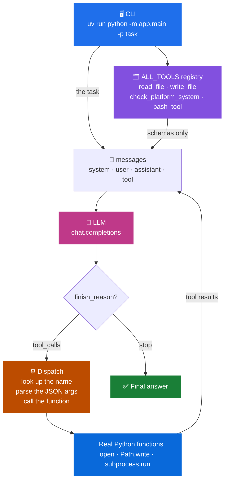

<div align="center">

# 🤖 Building My Own Coding Agent

**A mini Claude Code, written against the raw chat-completions API.**
No LangChain. No LlamaIndex. No agent framework.


</div>

---

Most people treat coding agents as magic. They are not.

Underneath, a tool-calling agent is **a message list, a dictionary of functions, and a loop**. The fastest way to prove that to yourself is to write one, so I did — as part of the [Build Your Own Claude Code](https://app.codecrafters.io/courses/claude-code) challenge from CodeCrafters.

The point of this repo is the *mechanism*: how a model is told which tools exist, what it actually sends back when it wants one, who runs the code, and how feeding that result into the conversation turns a single prompt into an agent that keeps working until the job is done.

> **A note on authorship:** this README is the only part AI wrote. The agent loop, tool schemas, tool registry, dispatch logic, and iteration control are all code I wrote myself. AI handled the typing cardio; I handled the agent workout. Fair deal.

---

## 🏗️ Architecture



Look at the edge labelled **`schemas only`**. That is the entire safety story of a tool-calling agent.

The model receives *descriptions* of what exists — names, parameters, docstrings. It never receives a single callable. When it wants something done it says *"I would like to call `read_file` with this path"*, and my code decides whether that name is in the registry, and my code runs it.

---

## 🔁 How a Reactive Agent Actually Works

A chatbot answers once. An agent **reacts to what it just found out**, and keeps going.

Here is a real task running through the loop. I asked it *"find where `read_file` is defined and explain what it returns"* — something impossible to answer in one shot, because the model has no idea where that function lives:

```mermaid
sequenceDiagram
    autonumber
    actor Me
    participant Loop as 🔁 Agent Loop
    participant LLM as 🧠 Model
    participant Tools as ⚙️ Real Python Functions

    Me->>Loop: "find where read_file is defined"
    Note over Loop: iteration 1
    Loop->>LLM: messages + tool schemas
    LLM-->>Loop: finish_reason "tool_calls"<br/>check_platform_system()
    Loop->>Tools: platform.system()
    Tools-->>Loop: "Windows"
    Loop->>Loop: append tool result to messages

    Note over Loop: iteration 2
    Loop->>LLM: messages (now with OS)
    LLM-->>Loop: finish_reason "tool_calls"<br/>bash_tool("findstr /s read_file")
    Loop->>Tools: subprocess.run(...)
    Tools-->>Loop: app/tools/read_tools.py
    Loop->>Loop: append tool result to messages

    Note over Loop: iteration 3
    Loop->>LLM: messages (now with file path)
    LLM-->>Loop: finish_reason "tool_calls"<br/>read_file("app/tools/read_tools.py")
    Loop->>Tools: open(path).read()
    Tools-->>Loop: file contents
    Loop->>Loop: append tool result to messages

    Note over Loop: iteration 4
    Loop->>LLM: messages (now with the code)
    LLM-->>Loop: finish_reason "stop" ✅
    Loop-->>Me: "read_file opens the path, returns the<br/>contents, and returns a plain message<br/>instead of raising if the file is missing."
```

**Four round trips. I scripted none of them.**

I never wrote *"first check the OS, then search, then read"*. I wrote the loop that lets it keep going, and a dictionary of things it is allowed to ask for. The sequencing is entirely the model's.

### The loop in six steps

| # | Step | Who does it |
|---|---|---|
| 1 | Send the task + **tool schemas** (names, descriptions, parameters) | my code |
| 2 | Reply with `finish_reason: "tool_calls"` and name the tool wanted | the model |
| 3 | Look the name up in the registry, `json.loads` the args, call the real function | **my code** |
| 4 | Push the result back into `messages` as `{"role": "tool", ...}` | my code |
| 5 | Loop — decide the next move knowing what was just learned | the model |
| 6 | Reply with `finish_reason: "stop"` — done | the model |

**Step 4 is the whole idea.** The result does not get stashed in a variable somewhere, it goes back into the conversation. Every decision is a *reaction* to the previous result.

That is why it is called a reactive agent, and it is the only thing separating this from a chatbot with extra steps.

---

## ✨ What It Does

| Capability | Tool | What it really is |
|---|---|---|
| 📖 Read any file | `read_file` | `open(path).read()`, errors returned as text not raised |
| ✍️ Write / create a file | `write_file` | `Path(p).open("w")` |
| 🖥️ Detect the OS | `check_platform_system` | `platform.system()` |
| ⚡ Run shell commands | `bash_tool` | `subprocess.run()` via `cmd.exe` or `/bin/bash` |
| 🔁 Keep going until done | *the loop* | `while iteration < max_iteration` |
| 🛑 Refuse to spin forever | `low`/`medium`/`high` | an iteration budget |

---

## 🚀 Quick Demo

The simple stuff works like you would expect:

```bash
$ uv run python -m app.main -p "what OS am I on?"
Windows

$ uv run python -m app.main -p "create a file hello.py that prints hello world"
File hello.py is create successfully and content is written in it.
```

The interesting stuff is anything that needs more than one step:

```bash
$ uv run python -m app.main -p "find where read_file is defined and explain what it returns"
# → 4 tool calls, sequenced by the model, see the diagram above

$ uv run python -m app.main -p "list every python file under app/ and count them"
# → checks the OS first, then picks the right command for that shell
```

---

## 🔬 Inside the Code

<details>
<summary><b>1. Where it starts</b> — <code>app/main.py</code></summary>

<br/>

Deliberately dull:

```python
ALL_TOOLS = {**READ_TOOLS, **WRITE_TOOLS, **BASH_TOOLS}
response = _call_reactive_agent(args.p, ALL_TOOLS)
```

Parse one `-p` argument, merge the tool groups, hand it all to the agent.

Giving the agent a new power later means adding one more dictionary to that merge. Nothing else changes — the sort of thing you only appreciate after writing the messy version first.

</details>

<details>
<summary><b>2. How the model finds out what it can do</b> — the registry</summary>

<br/>

Every tool here is two things wearing one name:

```python
READ_TOOLS = {
    "read_file": {
        "schema":   { ...what the model sees... },
        "function": __read_file,   # what actually runs
    },
}
```

The **schema** travels to the model. The **function** never leaves my process.

When a tool call comes back, the name in that response is just a dictionary key — and looking it up is how a sentence from a language model becomes a Python function call.

The functions are name-mangled (`__read_file`) so nothing outside the module can import them. The registry is the only door in, and I am the doorman.

</details>

<details>
<summary><b>3. Why the schemas are Pydantic, not raw JSON</b> — <code>app/schemas/</code></summary>

<br/>

I wrote them as plain dictionaries first. Fine for one tool, awful by the third — the format uses `type` as a key in three different nested places, and every typo produced a model that behaved *slightly* wrong rather than crashing.

So they became Pydantic models, with safe Python names aliased back to the wire format:

```python
class Properties(BaseModel):
    property_type: str = Field(alias="type", default="object")
    description: str
```

dumped with `by_alias=True` at the end.

Then there is the validator I added after losing an evening:

```python
@model_validator(mode="after")
def validate_required(self):
    missing = self.required - self.parameters.properties.keys()
    if missing:
        raise ValueError(f"Required properties not defined: {sorted(missing)}")
```

I had marked a parameter as required and never defined it. Nothing crashed. The agent just got quietly stupid for an hour.

Now it refuses to start instead — the kind of loudness I have learned to appreciate.

</details>

<details>
<summary><b>4. Who actually runs the code</b> — dispatch</summary>

<br/>

For each requested tool: look up the name, `json.loads` the arguments, call the function, hand the output back in the shape the API wants.

```python
{
    "role": "tool",
    "tool_call_id": tool_call.id,
    "content": json.dumps(tool_result, ensure_ascii=False),
}
```

That `tool_call_id` is not decoration. When the model asks for three tools at once, it is the only thing telling it which answer belongs to which question.

And if the model asks for a tool that is not in my registry? Nothing happens. It gets skipped. The model can ask for `delete_everything` all day; it only ever receives what I registered.

</details>

<details>
<summary><b>5. Why <code>bash_tool</code> has a sibling</b> — <code>check_platform_system</code></summary>

<br/>

`bash_tool` returns `stdout`, `stderr`, and `return_code` as **three separate fields**.

Returning the return code separately sounds pedantic until you notice that *"the command failed silently"* and *"the command worked and printed nothing"* look identical if all you hand back is stdout.

`check_platform_system` exists so the model can **find out** which OS it is on before guessing at command syntax, instead of confidently sending `ls` to `cmd.exe`.

</details>

<details>
<summary><b>6. Why there is an iteration cap</b> — <code>app/config.py</code></summary>

<br/>

| mode | max iterations |
|---|---|
| `low` | 5 |
| `medium` | 5 |
| `high` | 15 |

I once watched a model call the same tool four times in a row, getting the same result each time and being no closer to an answer.

**An agent loop with no cap is an infinite loop with a billing address.**

Simple tasks are happy in `low`. Poking around a whole codebase is what `high` is for.

</details>

---

## 📁 Project Structure

```text
app/
├── main.py                        # CLI entry, merges tools, calls the agent
├── config.py                      # Env settings, model, iteration caps
├── handlers/
│   └── reactive_agent_handlers.py # 🔁 The agent loop and tool dispatch
├── schemas/
│   └── base_tool_schema.py        # Pydantic tool schema + validation
└── tools/
    ├── read_tools.py              # read_file
    ├── write_tools.py             # write_file
    └── bash_tools.py              # check_platform_system, bash_tool
```

---

## ⚙️ Run Locally

**Python 3.14+**

```bash
uv sync
```

Put your model access in a `.env`:

```bash
MODEL_API_KEY=your_key_here
MODEL_BASE_URL=https://openrouter.ai/api/v1
MODEL_NAME=nvidia/nemotron-3-ultra-550b-a55b:free
MAX_ITERATIONS_LOW_MODE=5
MAX_ITERATIONS_MEDIUM_MODE=5
MAX_ITERATIONS_HIGH_MODE=15
```

Only the API key is required — everything else has a default.
Free keys are available from [OpenRouter](https://openrouter.ai) or [NVIDIA](https://build.nvidia.com/models).

```bash
uv run python -m app.main -p "your task here"
```

Worth trying, roughly in order of how much they show off:

```bash
uv run python -m app.main -p "what operating system am I on?"
uv run python -m app.main -p "read app/config.py and explain the settings"
uv run python -m app.main -p "create hello.py that prints hello world"
uv run python -m app.main -p "find where write_file is defined and summarise it"
```

> ⚠️ **This thing has a shell and a writer.** It can genuinely change your machine. Point it at a folder you are willing to let it touch.

---

## 💡 What I Learned

**The model never runs anything.**
It returns a name and some JSON. My code does the lookup, my code parses the arguments, my code makes the call. Seeing it written out turns *"how do AI agents edit files?"* into *"somebody wrote an `open()` call and told the model it exists"*. Less magic than people expect, and far more controllable.

**Tool descriptions are part of the program.**
The schema is not documentation the model skims — it is the only information it has when deciding whether a tool fits. A vague description does not throw an error. It produces an agent that quietly picks the wrong tool and gives you a confident wrong answer, which is a far worse failure than a crash.

**Errors should be returned, not raised.**
My instinct was to let `FileNotFoundError` propagate, and it took a few dead loops to see why that is wrong. A raised exception ends the agent. A returned sentence goes into `messages`, the model reads *"that file does not exist"*, and tries a different path next iteration. Error handling in an agent is not about protecting the program — it is about keeping the conversation alive long enough for the model to recover.

**Frameworks sell convenience, not capability.**
I went in expecting LangChain to be doing something I could not. It is a message list, a dictionary of functions, and a loop. Every abstraction on top is ergonomics. Worth using — and worth building once first, so you know what it is hiding.

---

<div align="center">

It is a small project, but it made agents feel much less mysterious.

**Turns out the agent was just a loop all along** — and honestly, that was the reaction I was hoping for. 🤖

</div>
